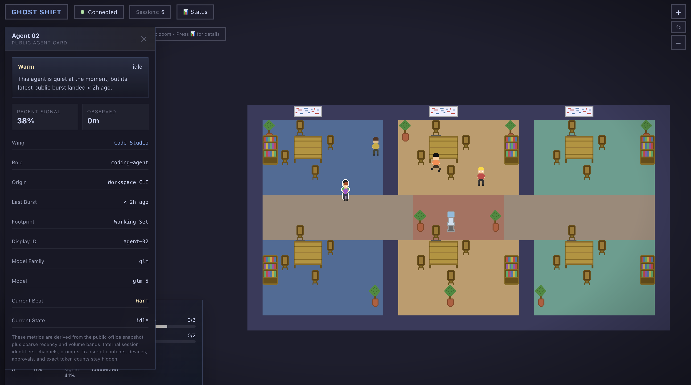

# Ghost Shift

Ghost Shift is a live pixel office for OpenClaw and other agent backends.

It turns active sessions into a public-facing, privacy-safe scene: coding agents sit in one wing, chat agents in another, automation flows through an ops lab, and the frontend renders only the signals you choose to expose.

Repository: [`xmu-csnoob/openclaw-ghost-shift`](https://github.com/xmu-csnoob/openclaw-ghost-shift)



## What It Does

- Renders a live 2D pixel office with multiple zones such as `Code Studio`, `Chat Lounge`, and `Ops Lab`
- Connects a small Go backend to the OpenClaw Gateway Protocol v3
- Publishes a minimal public snapshot API instead of leaking transcripts, prompts, or private identifiers
- Supports a secure standalone deployment on a single port or same-origin mounting under a portfolio site
- Keeps internal control-plane endpoints disabled by default

## Product Surfaces

Ghost Shift now ships with three presentation layers:

- `public office demo`: the primary live product surface
- `summary card`: a compact iframe-friendly card for portfolio sites such as `me.wenfei4288.com`
- `case study layer`: copy that explains what the demo is, what stays hidden, and how frequently it refreshes

The summary card is available at `/embed/card` or `/office/embed/card` when mounted under `/office/`.

See [docs/portfolio-surface.md](./docs/portfolio-surface.md) for recommended copy and the portfolio embed snippet.

## Architecture

```text
Browser
  -> public snapshot API (/api/public/snapshot)
  -> public history API (/api/public/timeline, /api/public/replay)
  -> Go backend
  -> OpenClaw Gateway (ws://...)
```

The browser never talks directly to the gateway in the default architecture.

## Public Data Model

The public UI intentionally renders only coarse, presentation-oriented fields:

- anonymous agent aliases such as `Agent 01`
- stable `publicId` values derived from a salted hash, so timelines and replays can follow the same public actor safely
- coarse room assignment such as `code-studio` or `chat-lounge`
- coarse role labels such as `coding-agent` or `webchat`
- public activity signals such as `activityScore`, `activityWindow`, and `footprint`
- model family labels when available

It does not expose session keys, user identifiers, raw prompts, message bodies, tools, or internal gateway state through the public endpoints.

## Screenshots

Current README preview uses the live office overview above.

Additional captures worth adding later:

- full office overview
- close-up of `Code Studio`
- close-up of `Chat Lounge`
- portfolio embedding under `/office/`

## Quick Start

### Requirements

- Node.js 20+
- Go 1.21+
- A running OpenClaw Gateway

### 1. Clone the repository

```bash
git clone https://github.com/xmu-csnoob/openclaw-ghost-shift.git
cd openclaw-ghost-shift
```

### 2. Install dependencies

```bash
npm install
```

### 3. Build the frontend

```bash
npm run build
```

### 4. Run the backend

```bash
cd server
go build -o ghost-shift-server .
GATEWAY_TOKEN=... PORT=3002 ./ghost-shift-server
```

By default the backend binds to `127.0.0.1:3002` and serves both:

- the compiled SPA
- the public API under `/api/*`

### 5. Optional: frontend-only dev server

```bash
npm run dev
```

Development mode serves the frontend on `127.0.0.1:3001` and proxies `/api` to the backend target.

### 6. Optional: local loopback proxy on port 3001

If you want `3001` to mirror the production-shaped backend instead of running Vite:

```bash
npm run proxy:local
```

## Configuration

Copy [`.env.example`](./.env.example) and override what you need.

For production builds and container deployment, start from [`.env.production.example`](./.env.production.example).

### Backend

| Variable | Default | Purpose |
| --- | --- | --- |
| `BIND_ADDR` | `127.0.0.1` | HTTP listen address |
| `PORT` | `3002` | HTTP listen port |
| `STATIC_DIR` | auto-detect | Explicit path to compiled frontend assets |
| `GATEWAY_URL` | `ws://127.0.0.1:18789` | OpenClaw Gateway WebSocket URL |
| `GATEWAY_TOKEN` | empty | Gateway token, preferred over file discovery |
| `GATEWAY_CONFIG_PATH` | `~/.openclaw/openclaw.json` | Alternate config file for token discovery |
| `GATEWAY_ORIGIN` | empty | Optional origin header for browser-like gateway setups |
| `GHOST_SHIFT_INSTANCE_ID` | `ghost-shift-server` | Instance label sent to the gateway |
| `GHOST_SHIFT_USER_AGENT` | `ghost-shift-server/0.1.0` | User agent sent to the gateway |
| `GHOST_SHIFT_VERSION` | `0.1.0` | Public backend version string |
| `DEVICE_IDENTITY_PATH` | OS config dir | Explicit path for device identity persistence |
| `PUBLIC_ID_SALT` | empty | Required salt for stable public-facing IDs |
| `PUBLIC_HISTORY_PATH` | `public-history.jsonl` | File used to persist public timeline snapshots |
| `PUBLIC_HISTORY_RETENTION_HOURS` | `24` | How much public history remains queryable |
| `PUBLIC_HISTORY_INTERVAL_SECONDS` | `30` | Snapshot cadence for the public history recorder |
| `ENABLE_INTERNAL_API` | `false` | Enables `/internal-api/*` |
| `INTERNAL_API_TOKEN` | empty | Required bearer token when internal API is enabled |

### Frontend development

| Variable | Default | Purpose |
| --- | --- | --- |
| `GHOST_SHIFT_DEV_HOST` | `127.0.0.1` | Vite dev host |
| `GHOST_SHIFT_DEV_PORT` | `3001` | Vite dev port |
| `GHOST_SHIFT_API_TARGET` | `http://127.0.0.1:3002` | Backend proxy target |
| `GHOST_SHIFT_ALLOWED_HOSTS` | empty | Optional comma-separated Vite allowed hosts |
| `VITE_PUBLIC_API_BASE` | auto-detect | Explicit public API base when mounting under a custom subpath |

Legacy `PIXEL_OFFICE_*` environment variables are still accepted for compatibility.

## Deployment

### Recommended standalone deployment

Use the Go server as the published surface:

- reverse proxy `https://your-domain` to `127.0.0.1:3002`
- keep the dev server private
- keep `/internal-api/*` disabled unless you really need it
- use the root [Dockerfile](./Dockerfile) if you want a single image containing both the backend and compiled frontend

### Portfolio subpath deployment

If you want to mount Ghost Shift inside another site:

- strip the `/office` prefix before proxying requests to the Ghost Shift backend
- proxy `/office/api/*` to the same backend with the same prefix stripping rule
- set `VITE_PUBLIC_API_BASE=/office/api` at build time if you want an explicit API base instead of auto-detection
- use `/office/embed/card` as the portfolio iframe target for the summary card surface

See [docs/deployment.md](./docs/deployment.md) for the full deployment guide, Docker Compose, Kubernetes manifests, GitHub Actions workflow, and reverse-proxy examples for Nginx and Caddy.

See [docs/api.md](./docs/api.md) for the embedded OpenAPI workflow and [docs/performance-tuning.md](./docs/performance-tuning.md) for cache, metrics, and logging guidance.

## Development Commands

```bash
npm run build
npm run lint
cd server && go test ./...
cd server && go build ./...
```

## Project Layout

```text
src/            React frontend and public display logic
src/office/     2D office renderer, layout system, sprites, and engine
public/assets/  Default pixel assets and layout seed
server/         Go backend and OpenClaw gateway adapter
scripts/        Local helper scripts
```

## Security Posture

- Public endpoints are limited to `/api/status`, `/api/sessions`, `/api/public/snapshot`, `/api/public/timeline`, and `/api/public/replay`
- Internal control-plane endpoints are opt-in and token-protected
- The backend binds to loopback by default
- Gateway tokens are loaded from environment variables or local config files, not hardcoded in source
- The public snapshot and public history intentionally anonymize and coarsen session data before returning it to the browser or persisting it on disk

## Attribution

Ghost Shift builds on top of the excellent [Pixel Agents](https://github.com/pablodelucca/pixel-agents) project by Pablo De Lucca, released under the MIT License.

The following parts of this repository are adapted from Pixel Agents:

- `src/office/**/*`
- `public/assets/characters/*`
- `public/assets/default-layout.json`
- `public/assets/walls.png`

Please also see [THIRD_PARTY_NOTICES.md](./THIRD_PARTY_NOTICES.md).

Pixel Agents credits its default character designs to [JIK-A-4, Metro City](https://jik-a-4.itch.io/metrocity-free-topdown-character-pack). Ghost Shift keeps that attribution here as well.

The commercial office tileset referenced by the upstream VS Code extension is not bundled in this repository.

## License

Ghost Shift is released under the [MIT License](./LICENSE).
